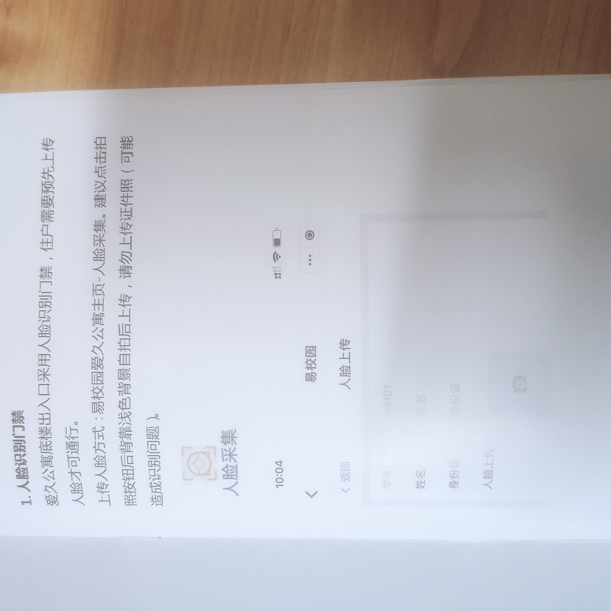
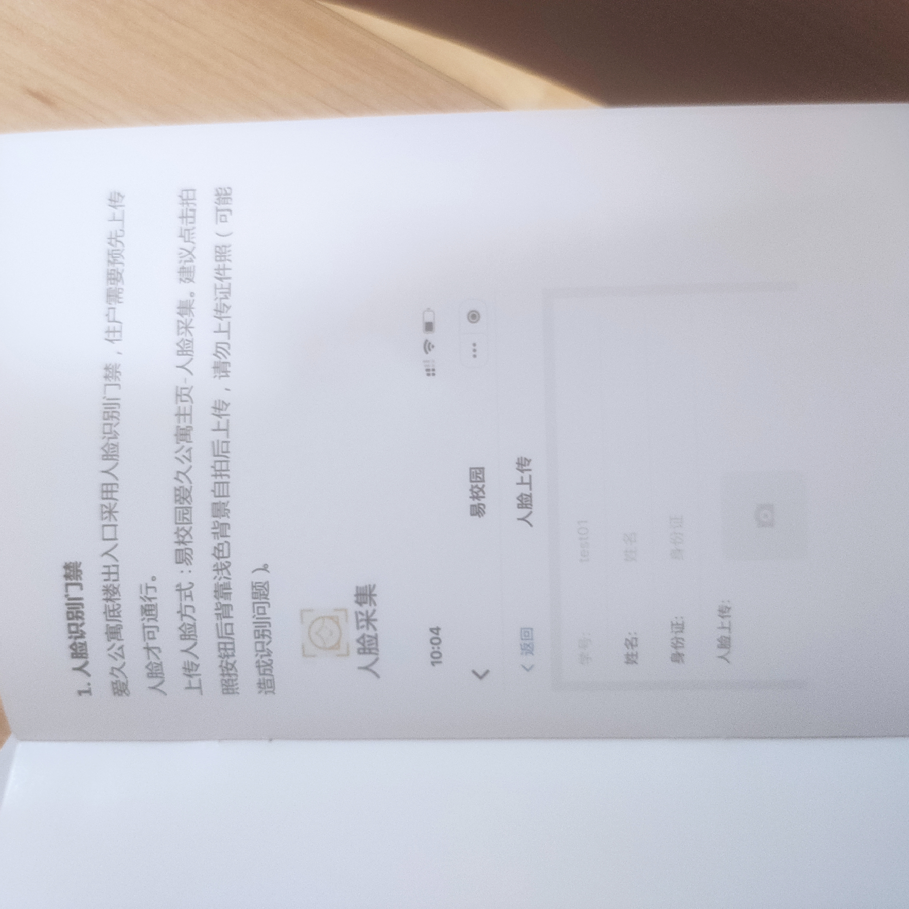
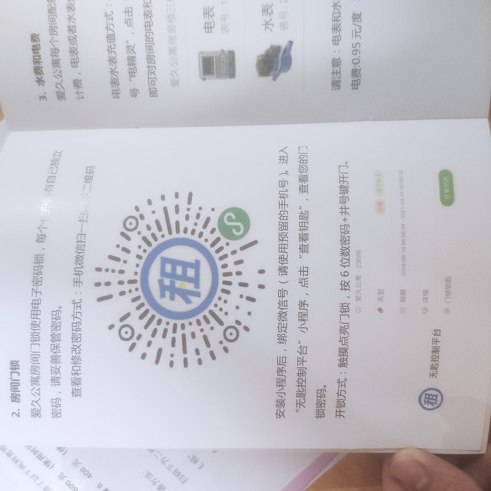
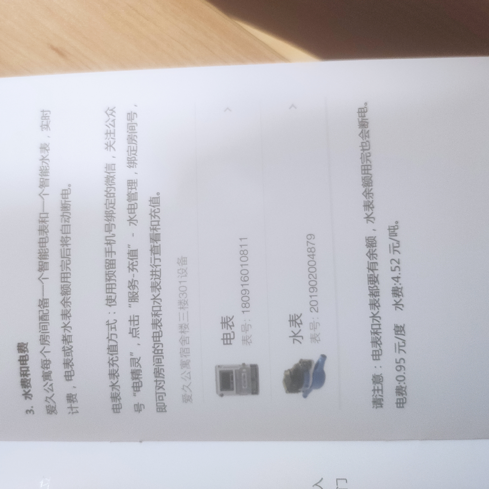
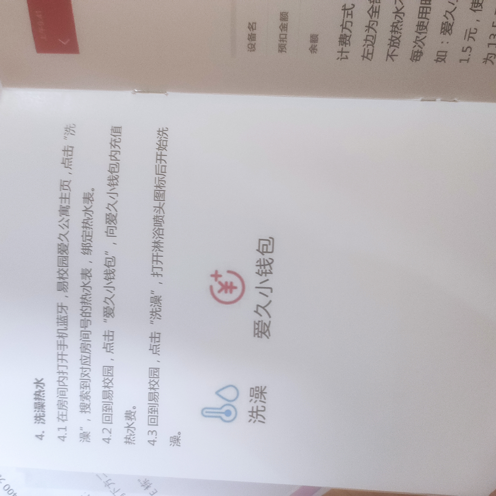
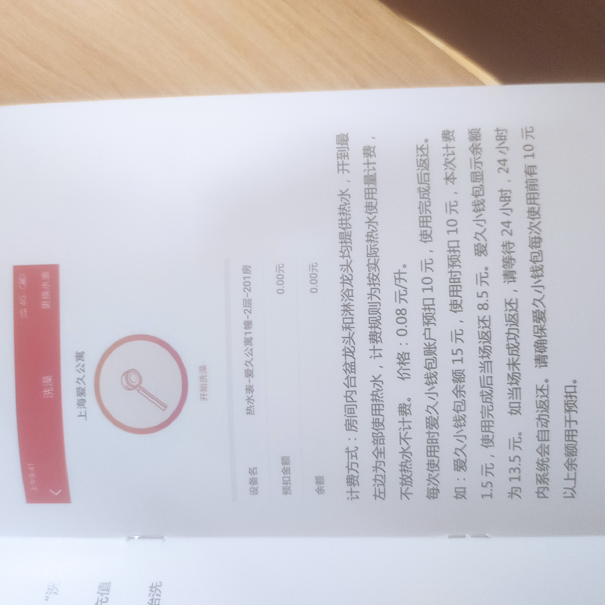
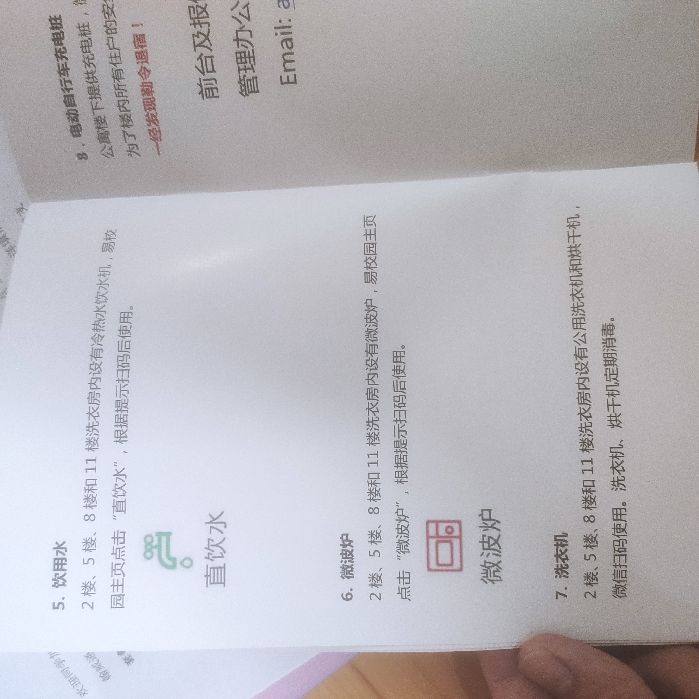
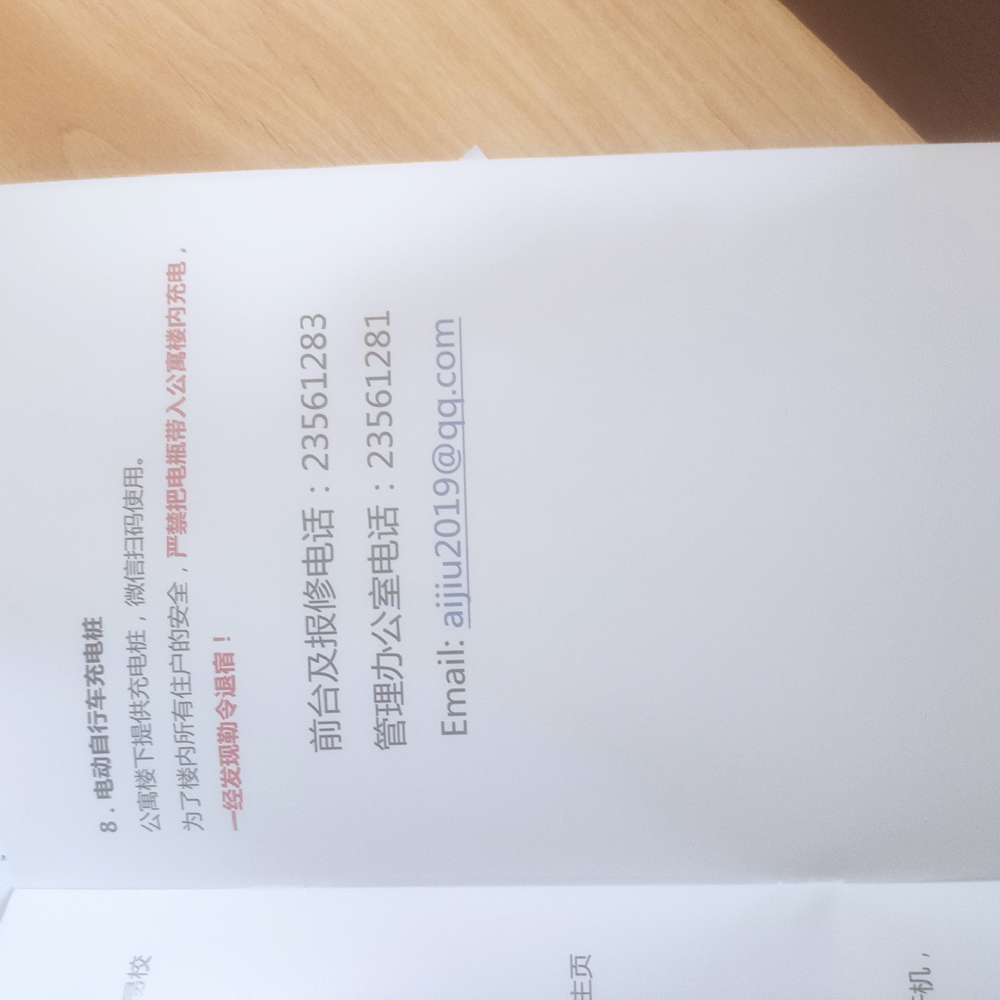

# 爱久公寓

- 通勤: https://mp.weixin.qq.com/s/9cPApHSqlOvynRzF52FmfQ | 842 路公交车
- 所在地区: 上海上海市杨浦区殷行街道
- 详细地址: 国伟路 300 号爱久家园爱久公寓 E 栋

## 公告

- [爱久指南丨生活与出行攻略](https://mp.weixin.qq.com/s/0EiWoQtT9KlGCATYWDnY0Q)
- [爱久指南丨新生报到攻略](https://mp.weixin.qq.com/s/QBbLs5BQ4y1MUnXna3MLYw)

## 手册

|                                     |                                     |
| ----------------------------------- | ----------------------------------- |
|  |  |
|  |  |
|  |  |
|  |  |

## local

### 842

爱久公寓 -> 邯郸校区(五角场附近)
